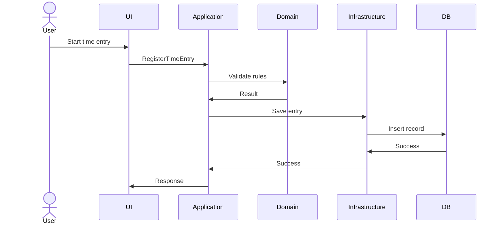

# Use Case Flow

```mermaid
sequenceDiagram

actor User

User ->> UI: Start time entry
UI ->> Application: RegisterTimeEntry
Application ->> Domain: Validate rules
Domain ->> Application: Result
Application ->> Infrastructure: Save entry
Infrastructure ->> DB: Insert record
DB ->> Infrastructure: Success
Infrastructure ->> Application: Success
Application ->> UI: Response
```